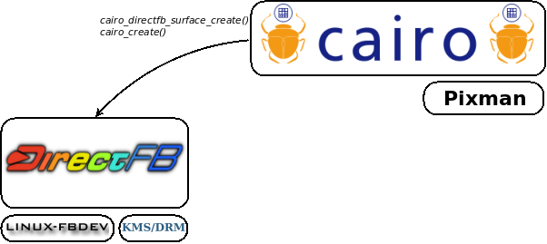
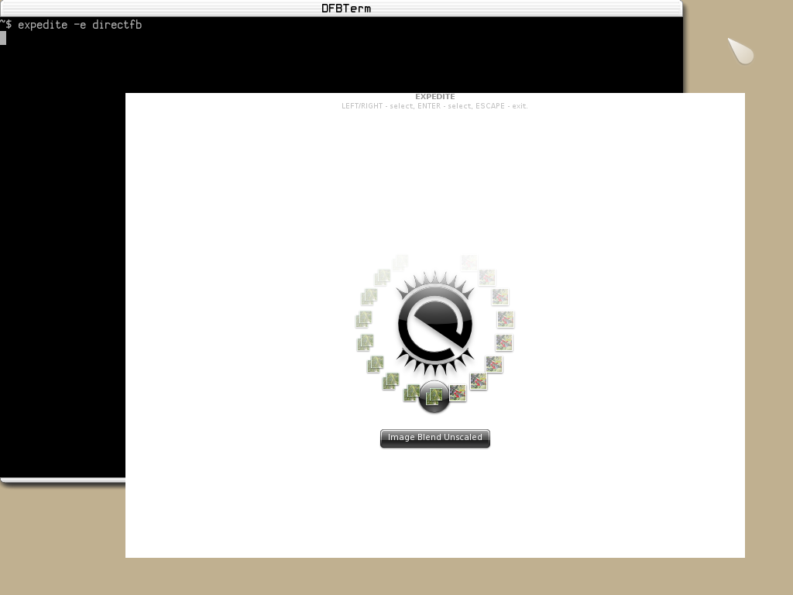
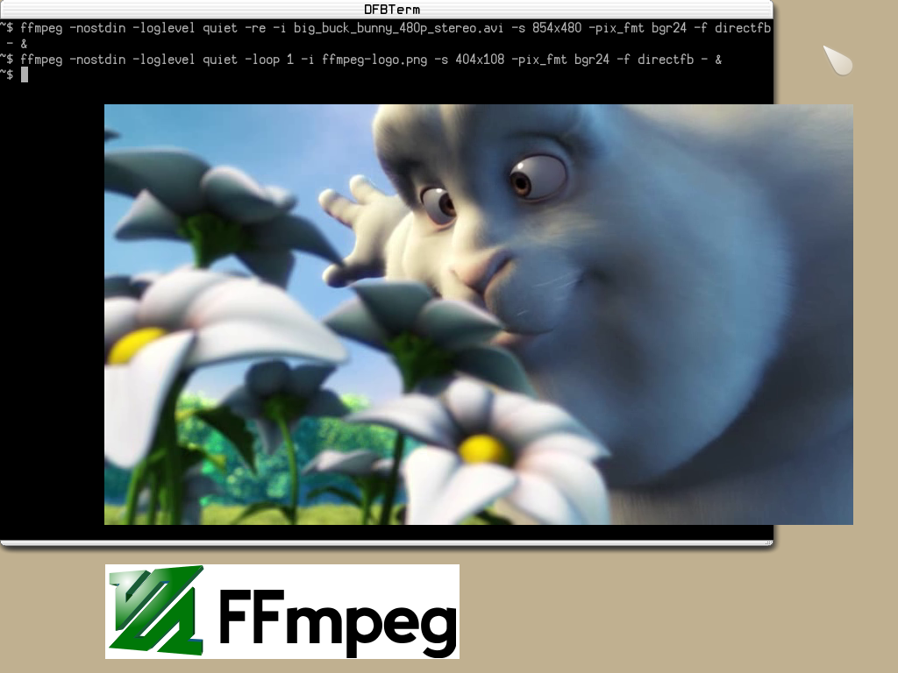

Welcome to [**HiGFXback**](README.md) with the _DirectFB_ graphics backend!

# Contents

* [Getting started](#getting-started)
    * [DFBTerm](#dfbterm)
    * [DirectFB-examples](#directfb-examples)
    * [DirectFB toolkits](#directfb-toolkits)
* [Vulkan rendering](#vulkan-rendering)
* [OpenGL rendering](#opengl-rendering)
    * [DirectFBGL](#directfbgl)
    * [EGL for DirectFB](#egl-for-directfb)
* [Drawing libraries](#drawing-libraries)
    * [Cairo](#cairo)
    * [Evas](#evas)
* [Multimedia frameworks](#multimedia-frameworks)
    * [FFmpeg](#ffmpeg)
    * [GStreamer](#gstreamer)
    * [Xine](#xine)
    * [DirectFB-media](#directfb-media)
* [Tools](#tools)
    * [DFBView](#dfbview)
    * [Projektor](#projektor)
    * [NetSurf, Links](#netsurf-links)
    * [DFBSee, ilixi_player, MPlayer](#dfbsee-ilixi_player-mplayer)
* [Graphics abstraction layers](#graphics-abstraction-layers)
    * [GLUT](#glut)
    * [SDL](#sdl)
* [User interface toolkits](#user-interface-toolkits)
    * [GTK+](#gtk)
    * [Qt](#qt)
    * [EFL](#efl)
    * [FLTK](#fltk)
* [Applications](#applications)

# Getting started

Components running on _DirectFB_ graphics backend are based on _**libdirectfb.so** library_. Compositing windowing system is performed by the default _**libdirectfb.so** window manager module_ with _**libdirectfbwm_default.so** plugin_. Cooperation between various process is achieved through the _**fusion.ko** kernel module_.

If the current graphics backend used on **HiGFXback** is not _DirectFB_, switch on it with `startdfb` command. Select one of the following graphics driver interface available on **HiGFXback** and used by _**libdirectfb.so** library_ for the display:

* _Linux Framebuffer_ interface (`/dev/fb0`) handled with _**libdirectfb_fbdev.so** plugin_
* _KMS/DRM_ interface (`/dev/dri/card0`) handled with _**libdirectfb_drmkms.so** plugin_

But depending on the platform, it's possible to use specific graphics driver interfaces based on the _**libdirectfb.so** system module_ architecture. If available on the platform, hardware accelerated graphic rendering can also be achieved based on the _**libdirectfb.so** gfxdriver module_ architecture.

When starting on _DirectFB_ graphics backend with `startdfb` command, select one of the following input driver interface available on **HiGFXback** and used by _**libdirectfb.so** library_ for managing the keyboard:

* _console_ interface (`/dev/tty0`) handled with _**libdirectfb_keyboard.so** plugin_
* _event device_ interface (`/dev/input/event0`) handled with _**libdirectfb_linux_input.so** plugin_

and for managing the mouse:

* _PS/2 mouse_ interface (`/dev/psaux`) handled with _**libdirectfb_ps2mouse.so** plugin_
* _event device_ interface (`/dev/input/event1`) handled with _**libdirectfb_linux_input.so** plugin_

But depending on the input peripheral, it's possible to use specific input driver interfaces based on the _**libdirectfb.so** inputdriver module_ architecture.

### DFBTerm

When starting on _DirectFB_ graphics backend, _**dfbterm**_ terminal emulator is displayed.
System informations about _DirectFB_ settings can be get with _**dfbinfo**_.

[Back to Top](#contents)

### DirectFB-examples

Programs running on _DirectFB_ graphics backend are available as examples, tests or benchmarks.

[Back to Top](#contents)

### DirectFB toolkits

On **HiGFXback**, _LiTE_ interfaces are provided by _**liblite.so** library_ and _ilixi_ interfaces are provided by _**libilixi.so** library_.

_**LiTE-examples**_ programs are available as examples.

_**ilixi-apps**_ programs are available as examples.

[Back to Top](#contents)

# Vulkan rendering

For display rendering with _DirectFB_ graphics backend, _Vulkan_ implementation in _**libvulkan.so** library_ (loading library from _Vulkan-Loader_) and its ICD (Installable Client Driver) relies on _DirectFB WSI_ interface.

On **HiGFXback**, _DirectFB WSI_ interfaces (Window System Integration for _DirectFB_) are used with one of the following ICD selected with `VK_ICD_FILENAMES` environment variable:

* _Mesa_ associated to _**lvp_icd.json** manifest file_
* _SwiftShader_ associated to _**swiftshader_icd.json** manifest file_

But depending on the platform, specific ICD can be used.

_**Vulkan-Tools**_, _**Vulkan-Examples**_, _**vkcube2**_ and _**yagears2**_ programs are available as examples, tests or benchmarks.

[Back to Top](#contents)

# OpenGL rendering

For display rendering with _DirectFB_ graphics backend, _OpenGL_ implementation in _**libGL.so** library_, but also _OpenGL ES 1.1 CM_ implementation in _**libGLESv1_CM.so** library_ and _OpenGL ES 2.0_ implementation in _**libGLESv2.so** library_, rely on _DirectFBGL_ or _EGL for DirectFB_ interfaces.

Loading libraries can be used:

* _**libGLEW.so** library_ from _GLEW_ (OpenGL Extension Wrangler)
* _**libepoxy.so** library_ from _Epoxy_

### DirectFBGL

On **HiGFXback**, _DirectFBGL_ interfaces (_OpenGL_ extension for _DirectFB_) are used with one of the following implementation selected with `alternatives-GL` command:

* _Mesa_ with _**libidirectfbgl.so `->` libidirectfbgl_mesa.so** plugin_ and _**libGL.so `->` libmesaGL.so**, **libGLESv1_CM.so `->` libmesaGLESv1_CM.so**, **libGLESv2.so `->` libmesaGLESv2.so** libraries_
* _TinyGL_ with _**libidirectfbgl.so `->` libidirectfbgl_tinygl.so** plugin_ and _**libGL.so `->` libtinyGL.so** library_

But depending on the platform, specific implementation can be used.

_**mesa-demos**_ and _**yagears**_ programs are available as examples, tests or benchmarks.

[Back to Top](#contents)

### EGL for DirectFB

On **HiGFXback**, _EGL for DirectFB_ interfaces are used with one of the following implementation selected with `alternatives-GL`:

* _Mesa_ with _**libEGL.so `->` libmesaEGL.so**, **libGL.so `->` libmesaGL.so**, **libGLESv1_CM.so `->` libmesaGLESv1_CM.so**, **libGLESv2.so `->` libmesaGLESv2.so** libraries_
* _SwiftShader_ with _**libEGL.so `->` libswiftshaderEGL.so**, **libGLESv1_CM.so `->` libswiftshaderGLESv1_CM.so**, **libGLESv2.so `->` libswiftshaderGLESv2.so** libraries_

But depending on the platform, specific implementation can be used.

_**mesa-demos**_ and _**yagears**_ programs are available as examples, tests or benchmarks.

[Back to Top](#contents)

# Drawing libraries

### Cairo

On **HiGFXback**, _Cairo_ interfaces for _DirectFB_ graphics backend are provided by _**libcairo.so** library_.

_**cairo-demos**_ programs are available as examples, tests or benchmarks.

[Back to Top](#contents)

### Evas

On **HiGFXback**, _Evas_ interfaces for _DirectFB_ graphics backend are provided by _**libevas.so** library_.

_**expedite**_ program is available as examples, tests or benchmarks.

[Back to Top](#contents)

# Multimedia frameworks

### FFmpeg

On **HiGFXback**, _FFmpeg_ interfaces for _DirectFB_ graphics backend are provided by _**libavformat.so, libavcodec.so, libswscale.so** libraries_ and rely on _**libavdevice.so** library_ for output.

_**ffmpeg**_ program is available as example.

[Back to Top](#contents)

### GStreamer

On **HiGFXback**, _GStreamer_ interfaces for _DirectFB_ graphics backend are provided by:

* _**libgstreamer-0.10.so** library_ on _GStreamer 0.10_
* _**libgstreamer-1.0.so** library_ on _GStreamer 1_

and rely on _**libgstdfbvideosink.so** plugin_ for output.

_**gst-launch-0.10**_ program is available as example on _GStreamer 0.10_.

_**gst-launch-1.0**_ program is available as example on _GStreamer 1_.

[Back to Top](#contents)

### Xine

On **HiGFXback**, _Xine_ interfaces for _DirectFB_ graphics backend are provided by _**libxine.so** library_ and rely on _**xineplug_vo_out_directfb.so** plugin_ for output.

_**xine-ui**_ program is available as example.

[Back to Top](#contents)

### DirectFB-media

On **HiGFXback**, _DirectFBImageProvider_ and _DirectFBVideoProvider_ interfaces are provided.

_**df_image_sample**_ program is available as example.

_**df_video_sample**_ program is available as example.

[Back to Top](#contents)

# Tools

### DFBView

### Projektor

### NetSurf, Links

### DFBSee, ilixi_player, MPlayer

[Back to Top](#contents)

# Graphics abstraction layers

### GLUT

On **HiGFXback**, _GLUT (openGL Utility Toolkit)_ interfaces running on _DirectFB_ graphics backend are provided by one of the following implementation selected with `alternatives-glut` command:

* _MesaGLUT_ with _**libglut.so `->` libmesaglut.so** library_
* _TinyGLUT_ with _**libglut.so `->` libtinyglut.so** library_

For _OpenGL_ rendering, note that _EGL for DirectFB_ interfaces can also be used internally by _GLUT_ implementations instead of _DirectFBGL_ interfaces.

_**mesa-demos**_ and _**yagears**_ programs are available as examples, tests or benchmarks.

[Back to Top](#contents)

### SDL

On **HiGFXback**, _SDL (Simple Directmedia Layer)_ interfaces running on _DirectFB_ graphics backend are provided by:

* _**libSDL.so** library_ on _SDL 1_
* _**libSDL2.so** library_ on _SDL 2_

For _OpenGL_ rendering, note that _EGL for DirectFB_ interfaces can also be used internally by _SDL_ instead of _DirectFBGL_ interfaces.

_**SDL-test**_ and _**yagears**_ programs are available as examples, tests or benchmarks on _SDL 1_.

_**SDL2-test**_ and _**yagears2**_ programs are available as examples, tests or benchmarks on _SDL 2_.

[Back to Top](#contents)

# User interface toolkits

### GTK+

Graphical user interfaces can rely on _GTK+_ (Gimp ToolKit) using the port for _DirectFB_ graphics backend.
Web rendering can then rely on _WebKitGTK+_, a port of the WebKit browser engine for _GTK+_.

On **HiGFXback**, _GTK+_ interfaces running on _DirectFB_ graphics backend are provided by:

* _**libgtk-2.0.so**, **libgtkgl-2.0.so** libraries_ on _GTK+ 2_
* _**libgtk-3.0.so**, **libgtkgl-3.0.so** libraries_ on _GTK+ 3_

For _OpenGL_ rendering, note that _EGL for DirectFB_ interfaces can also be used internally by _GTK+_ instead of _DirectFBGL_ interfaces.

_**gtk-demo**_, _**gtk-tests**_, _**gtkperf**_ and _**yagears**_ programs are available as examples, tests or benchmarks.

On **HiGFXback**, _WebKitGTK+_ interfaces for _GTK+_ with _DirectFB_ graphics backend are provided by:

* _**libwebkitgtk-2.0.so** library_ on _GTK+ 2_
* _**libwebkitgtk-3.0.so** library_ on _GTK+ 3_

For _WebGL_ rendering, note that _EGL for DirectFB_ interfaces can also be used instead of _DirectFBGL_ interfaces.

_**GtkLauncher**_ program is available as example.

[Back to Top](#contents)

### Qt

Graphical user interfaces can rely on _Qt_ (Q toolKit) using the port for _DirectFB_ graphics backend.
Web rendering can then rely on _QtWebKit_, a port of the WebKit browser engine for _Qt_.

On **HiGFXback**, _Qt_ interfaces running on _DirectFB_ graphics backend are provided by:

* _**libQtGui.so** and **libQtOpenGL.so** libraries_ on _Qt 4_
* _**libQt5Gui.so** and **libQt5OpenGL.so** libraries_ on _Qt 5_

For _OpenGL_ rendering, note that _EGL for DirectFB_ interfaces can also be used internally by _Qt_ instead of _DirectFBGL_ interfaces.

_**qtdemo**_, _**qt-examples**_, _**qtperf**_ and _**yagears**_ programs are available as examples, tests or benchmarks.

On **HiGFXback**, _QtWebKit_ interfaces for _Qt_ with _DirectFB_ graphics backend are provided by:

* _**libQtWebKit.so** library_ on _Qt 4_
* _**libQt5WebKit.so** library_ on _Qt 5_

For _WebGL_ rendering, note that _EGL for DirectFB_ interfaces can also be used instead of _DirectFBGL_ interfaces.

_**QtTestBrowser**_ program is available as example.

[Back to Top](#contents)

### EFL

Graphical user interfaces can rely on _EFL_ (Enlightenment Foundation Libraries) with _Elementary_ using the port for _DirectFB_ graphics backend.

On **HiGFXback**, _EFL_ with _Elementary_ interfaces running on _DirectFB_ graphics backend are provided by _**libelementary.so** library_.

For _OpenGL_ rendering, note that _EGL for DirectFB_ interfaces can also be used internally by _EFL_ with _Elementary_ instead of _DirectFBGL_ interfaces.

_**elementary-test**_, _**elementary-examples**_ and _**yagears**_ programs are available as examples, tests or benchmarks.

[Back to Top](#contents)

### FLTK

Graphical user interfaces can rely on _FLTK_ (Fast Light Tool Kit) using the port for _DirectFB_ graphics backend.

On **HiGFXback**, _FLTK_ interfaces running on _DirectFB_ graphics backend are provided by _**libfltk.so** and **libfltk_gl.so** libraries_.

For _OpenGL_ rendering, note that _EGL for DirectFB_ interfaces can also be used internally by _FLTK_ instead of _DirectFBGL_ interfaces.

_**fltk-test**_ and _**yagears**_ programs are available as examples, tests or benchmarks.

[Back to Top](#contents)

# Applications

| | |
--|--
 | _**ffplay**_ multimedia player

| | |
--|--
 | _**qemu**_ machine emulator

| | |
--|--
 | _**midori**_ web browser

| | |
--|--
 | _**qupzilla**_ web browser

| | |
--|--
 | _**BillardGL, gtktetris, pinball**_ games

[Back to Top](#contents)
