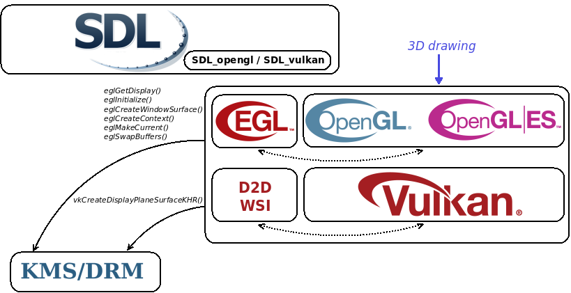

Welcome to [**HiGFXback**](README.md) with the _KMS/DRM_ graphics backend!

<a name="contents">

# Contents

* [Getting started](#getting-started)
  * [Kmscon](#kmscon)
  * [drm-tests, drm-howto](#drm-tests-drm-howto)
  * [evtest, libevdev-events](#evtest-libevdev-events)
* [Vulkan rendering](#vulkan-rendering)
* [OpenGL rendering](#opengl-rendering)
* [Multimedia frameworks](#multimedia-frameworks)
  * [FFmpeg](#ffmpeg)
  * [GStreamer](#gstreamer)
* [Tools](#tools)
  * [Kmsi](#kmsi)
  * [Kmspdf](#kmspdf)
  * [mpv](#mpv)
* [Graphics abstraction layers](#graphics-abstraction-layers)

<a name="getting-started">

# Getting started

Components running on _KMS/DRM_ graphics backend just use the _DRM_ (Direct Rendering Manager) graphics driver interface (`/dev/dri/card0`) accessible through the _**libdrm.so** library_. As they directly access the memory of the display device, there is no compositing windowing system.

If the current graphics backend used on **HiGFXback** is not _KMS/DRM_, switch on it with `startdrm` command.

<p align="center"></p>

Components running on _KMS/DRM_ graphics backend directly handle keyboard and mouse input events with the _event device_ input driver interface (`/dev/input/event0` and `/dev/input/event1`) available on **HiGFXback**.

But depending on the input peripheral, it's possible to use specific input driver interfaces if supported by the component running on the _KMS/DRM_ graphics backend.

Note that _event device_ input driver interface is also accessible through the _**libevdev.so** library_.

<a name="kmscon">

### Kmscon

When starting on _KMS/DRM_ graphics backend, _**kmscon**_ terminal emulator is displayed.
System informations about _KMS/DRM_ settings can be get with _**modetest**_.


[Back to Top](#contents)

<a name="drm-tests-drm-howto">

### drm-tests, drm-howto

Programs running on _KMS/DRM_ graphics backend are available as examples, tests or benchmarks.

```
$ modetest -s 23:1024x768
$ modeset
```


[Back to Top](#contents)

<a name="evtest-libevdev-events">

### evtest, libevdev-events

Programs are available for testing _event device_ input interfaces used by components running on _KMS/DRM_ graphics backend.


[Back to Top](#contents)

<a name="vulkan-rendering">

# Vulkan rendering

For display rendering with _KMS/DRM_ graphics backend, _Vulkan_ implementation in _**libvulkan.so** library_ (loading library from _Vulkan-Loader_) and its ICD (Installable Client Driver) relies on _Direct-to-Display WSI_ interface.

On **HiGFXback**, _Direct-to-Display WSI_ interfaces (Window System Integration for _KMS/DRM_) are used with one of the following ICD selected with `VK_ICD_FILENAMES` environment variable:
  * _SwiftShader_ associated to _**swiftshader_icd.json** manifest file_
  * _Kazan_ associated to _**kazan_icd.json** manifest file_

But depending on the platform, specific ICD can be used.

<p align="center"></p>

_**Vulkan-Tools**_, _**Vulkan-Examples**_, _**vkcube2**_ and _**yagears2**_ programs are available as examples, tests or benchmarks.

```
$ vkcube
$ /drm/share/Vulkan-Examples/vulkanscene
$ vkcube2 -m khr -k 0:0:0
$ yagears2-vk -w vk-d2d
```


[Back to Top](#contents)

<a name="opengl-rendering">

# OpenGL rendering

For display rendering with _KMS/DRM_ graphics backend, _OpenGL_ implementation in _**libGL.so** library_, but also _OpenGL ES 1.1 CM_ implementation in _**libGLESv1_CM.so** library_ and _OpenGL ES 2.0_ implementation in _**libGLESv2.so** library_, rely on _EGL for KMS/DRM_ interface through _GBM_ (Generic Buffer Management) with the _**libgbm.so** library_.

Loading libraries can be used:
  * _**libGLEW.so** library_ from _GLEW_ (OpenGL Extension Wrangler)
  * _**libepoxy.so** library_ from _Epoxy_

On **HiGFXback**, _EGL for KMS/DRM_ interfaces are used with one of the following implementation selected with `alternatives-GL` command:
  * _Mesa_ with _**libEGL.so `->` libmesaEGL.so**, **libGL.so `->` libmesaGL.so**, **libGLESv1_CM.so `->` libmesaGLESv1_CM.so**, **libGLESv2.so `->` libmesaGLESv2.so** libraries_
  * _SwiftShader_ with _**libEGL.so `->` libswiftshaderEGL.so**, **libGLESv1_CM.so `->` libswiftshaderGLESv1_CM.so**, **libGLESv2.so `->` libswiftshaderGLESv2.so** libraries_

But depending on the platform, specific implementation can be used.

<p align="center"></p>

_**mesa-demos**_ and _**yagears**_ programs are available as examples, tests or benchmarks.

```
$ /drm/share/mesa-demos/eglkms
$ yagears -b egl-drm -e gl
$ yagears -b egl-drm -e glesv1_cm
$ yagears -b egl-drm -e glesv2
```


[Back to Top](#contents)

<a name="multimedia-frameworks">

# Multimedia frameworks

<a name="ffmpeg">

### FFmpeg

On **HiGFXback**, _FFmpeg_ interfaces for _KMS/DRM_ graphics backend are provided by _**libavformat.so, libavcodec.so, libswscale.so** libraries_ and rely on _**libavdevice.so** library_ for output.

_**ffmpeg**_ program is available as example.

```
$ ffmpeg -loglevel quiet -re -i big_buck_bunny_480p_stereo.avi -s 854x480 -pix_fmt bgr0 -f kmsdumb /dev/dri/card0
$ ffmpeg -loglevel quiet -loop 1 -i ffmpeg-logo.png -s 808:216 -pix_fmt bgr0 -f kmsdumb /dev/dri/card0
```


[Back to Top](#contents)

<a name="gstreamer">

### GStreamer

On **HiGFXback**, _GStreamer_ interfaces for _KMS/DRM_ graphics backend are provided by _**libgstreamer-1.0.so** library_ and rely on _**libgstkms.so** plugin_ for output.

_**gst-launch-1.0**_ program is available as example.

```
$ gst-launch-1.0 -q filesrc location=big_buck_bunny_480p_stereo.avi ! decodebin ! videoconvert ! videobox autocrop=true ! kmssink
$ gst-launch-1.0 -q filesrc location=gstreamer-logo.jpg ! decodebin ! videoconvert ! imagefreeze ! videobox autocrop=true ! kmssink
```


[Back to Top](#contents)

<a name="tools">

# Tools

<a name="kmsi">

### Kmsi

```
$ kmsi tux.jpg
$ kmsi gnu.png
```


<a name="kmspdf">

### Kmspdf

```
$ kmspdf -r poppler vulkan11-reference-guide.pdf
$ kmspdf -r mupdf opengles20-reference-card.pdf
```


<a name="mpv">

### mpv

```
$ mpv -quiet -vo=drm 02_gran_dillama_1080p.mp4
```


[Back to Top](#contents)

<a name="graphics-abstraction-layers">

# Graphics abstraction layers

On **HiGFXback**, _SDL (Simple Directmedia Layer)_ interfaces running on _KMS/DRM_ graphics backend are provided by _**libSDL2.so** library_.

<p align="center"></p>

_**SDL2-test**_ and _**yagears2**_ programs are available as examples, tests or benchmarks.

```
$ /drm/share/SDL2/test/testsprite2
$ /drm/share/SDL2/test/testgles2
$ yagears2-gui -t sdl -e glesv2
$ /drm/share/SDL2/test/testoverlay2 -scale 8
$ /drm/share/SDL2/test/testvulkan
$ yagears2-vk-gui -t sdl
```


[Back to Top](#contents)
