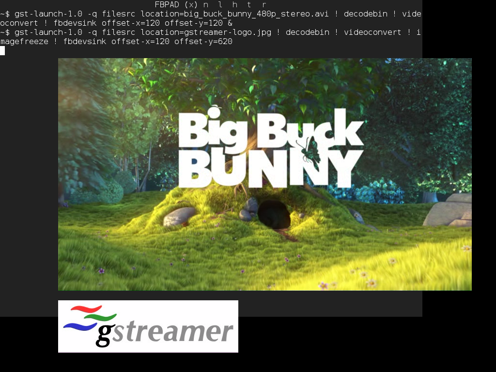
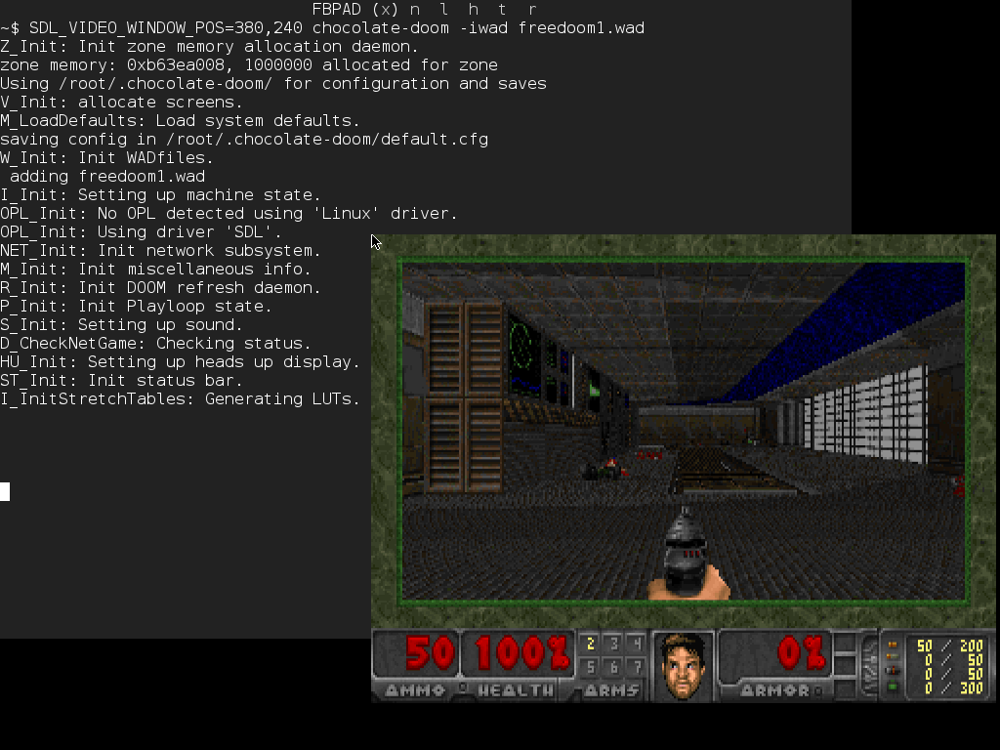

Welcome to [**HiGFXback**](README.md) with the _Linux Framebuffer_ graphics backend!

# Contents

* [Getting started](#getting-started)
    * [Fbpad](#fbpad)
    * [fb-test-app, fbmark](#fb-test-app-fbmark)
    * [showkey, input-events](#showkey-input-events)
    * [test-mouse, input-events](#test-mouse-input-events)
* [Vulkan rendering](#vulkan-rendering)
* [OpenGL rendering](#opengl-rendering)
    * [GLFBDev](#glfbdev)
    * [EGL for Linux Framebuffer](#egl-for-linux-framebuffer)
* [Drawing libraries](#drawing-libraries)
    * [Cairo](#cairo)
    * [Evas](#evas)
* [Multimedia frameworks](#multimedia-frameworks)
    * [FFmpeg](#ffmpeg)
    * [GStreamer](#gstreamer)
    * [Xine](#xine)
    * [VLC](#vlc)
* [Tools](#tools)
    * [Fbi, FIM](#fbi-fim)
    * [Fbpdf](#fbpdf)
    * [NetSurf, Links](#netsurf-links)
    * [Fbff, MPlayer](#fbff-mplayer)
* [Graphics abstraction layers](#graphics-abstraction-layers)
    * [GLUT](#glut)
    * [SDL](#sdl)
* [User interface toolkits](#user-interface-toolkits)
    * [GTK+](#gtk)
    * [Qt](#qt)
    * [EFL](#efl)
* [Applications](#applications)

# Getting started

Components running on _Linux Framebuffer_ graphics backend just use the _Linux Framebuffer_ graphics driver interface (`/dev/fb0`). As they directly access the memory of the display device, there is no compositing windowing system.

If the current graphics backend used on **HiGFXback** is not _Linux Framebuffer_, switch on it with `startfb` command.

Components running on _Linux Framebuffer_ graphics backend directly handle keyboard and mouse input events with one of the following input driver interface available on **HiGFXback**:

* _console_ interface (`/dev/tty0`)
* _PS/2 mouse_ interface (`/dev/psaux`)
* _event device_ interface (`/dev/input/event0` and `/dev/input/event1`)

But depending on the input peripheral, it's possible to use specific input driver interfaces if supported by the component running on the _Linux Framebuffer_ graphics backend.

Note that input driver interfaces used for mouse input events are also accessible through the _**gpm**_ (General Purpose Mouse) mouse server.

### Fbpad

When starting on _Linux Framebuffer_ graphics backend, _**fbpad**_ terminal emulator is displayed.
System informations about _Linux Framebuffer_ settings can be get with _**fbset**_.

[Back to Top](#contents)

### fb-test-app, fbmark

Programs running on _Linux Framebuffer_ graphics backend are available as examples, tests or benchmarks.

[Back to Top](#contents)

### showkey, input-events

Programs are available for testing keyboard input interfaces used by components running on _Linux Framebuffer_ graphics backend.

[Back to Top](#contents)

### test-mouse, input-events

Programs are available for testing mouse input interfaces used by components running on _Linux Framebuffer_ graphics backend.

[Back to Top](#contents)

# Vulkan rendering

For display rendering with _Linux Framebuffer_ graphics backend, _Vulkan_ implementation in _**libvulkan.so** library_ (loading library from _Vulkan-Loader_) and its ICD (Installable Client Driver) relies on _FBDev WSI_ interface.

On **HiGFXback**, _FBDev WSI_ interfaces (Window System Integration for _Linux Framebuffer_) are used with one of the following ICD selected with `VK_ICD_FILENAMES` environment variable:

* _Mesa_ associated to _**lvp_icd.json** manifest file_
* _SwiftShader_ associated to _**swiftshader_icd.json** manifest file_

But depending on the platform, specific ICD can be used.

_**Vulkan-Tools**_, _**Vulkan-Examples**_, _**vkcube2**_ and _**yagears2**_ programs are available as examples, tests or benchmarks.

[Back to Top](#contents)

# OpenGL rendering

For display rendering with _Linux Framebuffer_ graphics backend, _OpenGL_ implementation in _**libGL.so** library_, but also _OpenGL ES 1.1 CM_ implementation in _**libGLESv1_CM.so** library_ and _OpenGL ES 2.0_ implementation in _**libGLESv2.so** library_, rely on _GLFBDev_ or _EGL for Linux Framebuffer_ interfaces.

Loading libraries can be used:

* _**libGLEW.so** library_ from _GLEW_ (OpenGL Extension Wrangler)
* _**libepoxy.so** library_ from _Epoxy_

### GLFBDev

On **HiGFXback**, _GLFBDev_ interfaces (_OpenGL_ extension for _Linux Framebuffer_) are used with one of the following implementation selected with `alternatives-GL` command:

* _Mesa_ with _**libGL.so `->` libmesaGL.so**, **libGLESv1_CM.so `->` libmesaGLESv1_CM.so**, **libGLESv2.so `->` libmesaGLESv2.so** libraries_
* _TinyGL_ with _**libGL.so `->` libtinyGL.so** library_

But depending on the platform, specific implementation can be used.

_**mesa-demos**_ and _**yagears**_ programs are available as examples, tests or benchmarks.

[Back to Top](#contents)

### EGL for Linux Framebuffer

On **HiGFXback**, EGL for _Linux Framebuffer_ interfaces are used with one of the following implementation selected with `alternatives-GL` command:

* _Mesa_ with _**libEGL.so `->` libmesaEGL.so**, **libGL.so `->` libmesaGL.so**, **libGLESv1_CM.so `->` libmesaGLESv1_CM.so**, **libGLESv2.so `->` libmesaGLESv2.so** libraries_
* _SwiftShader_ with _**libEGL.so `->` libswiftshaderEGL.so**, **libGLESv1_CM.so `->` libswiftshaderGLESv1_CM.so**, **libGLESv2.so `->` libswiftshaderGLESv2.so** libraries_

But depending on the platform, specific implementation can be used.

_**mesa-demos**_ and _**yagears**_ programs are available as examples, tests or benchmarks.

[Back to Top](#contents)

# Drawing libraries

### Cairo

On **HiGFXback**, _Cairo_ interfaces for _Linux Framebuffer_ graphics backend are provided by _**libcairo.so** library_.

_**cairo-demos**_ programs are available as examples, tests or benchmarks.

[Back to Top](#contents)

### Evas

On **HiGFXback**, _Evas_ interfaces for _Linux Framebuffer_ graphics backend are provided by _**libevas.so** library_.

_**expedite**_ program is available as examples, tests or benchmarks.

[Back to Top](#contents)

# Multimedia frameworks

### FFmpeg

On **HiGFXback**, _FFmpeg_ interfaces for _Linux Framebuffer_ graphics backend are provided by _**libavformat.so, libavcodec.so, libswscale.so** libraries_ and rely on _**libavdevice.so** library_ for output.

_**ffmpeg**_ program is available as example.

[Back to Top](#contents)

### GStreamer

On **HiGFXback**, _GStreamer_ interfaces for _Linux Framebuffer_ graphics backend are provided by:

* _**libgstreamer-0.10.so** library_ on _GStreamer 0.10_
* _**libgstreamer-1.0.so** library_ on _GStreamer 1_

and rely on _**libgstfbdevsink.so** plugin_ for output.

_**gst-launch-0.10**_ program is available as example on _GStreamer 0.10_.

_**gst-launch-1.0**_ program is available as example on _GStreamer 1_.

[Back to Top](#contents)

### Xine

On **HiGFXback**, _Xine_ interfaces for _Linux Framebuffer_ graphics backend are provided by _**libxine.so** library_ and rely on _**xineplug_vo_out_fb.so** plugin_ for output.

_**xine-ui**_ program is available as example.

[Back to Top](#contents)

### VLC

On **HiGFXback**, _VLC_ interfaces for _Linux Framebuffer_ graphics backend are provided by _**libvlc.so** library_ and rely on _**libfb_plugin.so** plugin_ for output.

_**vlc**_ program is available as example.

[Back to Top](#contents)

# Tools

### Fbi, FIM

### Fbpdf

### NetSurf, Links

### Fbff, MPlayer

[Back to Top](#contents)

# Graphics abstraction layers

### GLUT

On **HiGFXback**, _GLUT (openGL Utility Toolkit)_ interfaces running on _Linux Framebuffer_ graphics backend are provided by one of the following implementation selected with `alternatives-glut` command:

* _MesaGLUT_ with _**libglut.so `->` libmesaglut.so** library_
* _TinyGLUT_ with _**libglut.so `->` libtinyglut.so** library_

For _OpenGL_ rendering, note that _EGL for Linux Framebuffer_ interfaces can also be used internally by _GLUT_ implementations instead of _GLFBDev_ interfaces.

_**mesa-demos**_ and _**yagears**_ programs are available as examples, tests or benchmarks.

[Back to Top](#contents)

### SDL

On **HiGFXback**, _SDL (Simple Directmedia Layer)_ interfaces running on _Linux Framebuffer_ graphics backend are provided by _**libSDL.so** library_.

For _OpenGL_ rendering, note that _EGL for Linux Framebuffer_ interfaces can also be used internally by _SDL_ instead of _GLFBDev_ interfaces.

_**SDL-test**_ and _**yagears**_ programs are available as examples, tests or benchmarks.

[Back to Top](#contents)

# User interface toolkits

### GTK+

Graphical user interfaces can rely on _GTK+_ (Gimp ToolKit) using the port for _Linux Framebuffer_ graphics backend.
Web rendering can then rely on _WebKitGTK+_, a port of the WebKit browser engine for _GTK+_.

On **HiGFXback**, _GTK+_ interfaces running on _Linux Framebuffer_ graphics backend are provided by _**libgtk-2.0.so** and **libgtkgl-2.0.so** libraries_.

For _OpenGL_ rendering, note that _EGL for Linux Framebuffer_ interfaces can also be used internally by _GTK+_ instead of _GLFBDev_ interfaces.

_**gtk-demo**_, _**gtk-tests**_, _**gtkperf**_ and _**yagears**_ programs are available as examples, tests or benchmarks.

On **HiGFXback**, _WebKitGTK+_ interfaces for _GTK+_ with _Linux Framebuffer_ graphics backend are provided by _**libwebkitgtk-2.0.so** library_.

For _WebGL_ rendering, note that _EGL for Linux Framebuffer_ interfaces can also be used instead of _GLFBDev_ interfaces.

_**GtkLauncher**_ program is available as example.

[Back to Top](#contents)

### Qt

Graphical user interfaces can rely on _Qt_ (Q toolKit) using the port for _Linux Framebuffer_ graphics backend.
Web rendering can then rely on _QtWebKit_, a port of the WebKit browser engine for _Qt_.

On **HiGFXback**, _Qt_ interfaces running on _Linux Framebuffer_ graphics backend are provided by _**libQtGui.so** and **libQtOpenGL.so** libraries_.

For _OpenGL_ rendering, note that _EGL for Linux Framebuffer_ interfaces can also be used internally by _Qt_ instead of _GLFBDev_ interfaces.

_**qtdemo**_, _**qt-examples**_, _**qtperf**_ and _**yagears**_ programs are available as examples, tests or benchmarks.

On **HiGFXback**, _QtWebKit_ interfaces for _Qt_ with _Linux Framebuffer_ graphics backend are provided by _**libQtWebKit.so** library_.

For _WebGL_ rendering, note that _EGL for Linux Framebuffer_ interfaces can also be used instead of _GLFBDev_ interfaces.

_**QtTestBrowser**_ program is available as example.

[Back to Top](#contents)

### EFL

Graphical user interfaces can rely on _EFL_ (Enlightenment Foundation Libraries) with _Elementary_ using the port for _Linux Framebuffer_ graphics backend.

On **HiGFXback**, _EFL_ with _Elementary_ interfaces running on _Linux Framebuffer_ graphics backend are provided by _**libelementary.so** library_.

For _OpenGL_ rendering, note that _EGL for Linux Framebuffer_ interfaces can also be used internally by _EFL_ with _Elementary_ instead of _GLFBDev_ interfaces.

_**elementary-test**_, _**elementary-examples**_ and _**yagears**_ programs are available as examples, tests or benchmarks.

[Back to Top](#contents)

# Applications

| | |
--|--
 | _**ffplay**_ multimedia player

| | |
--|--
 | _**qemu**_ machine emulator

| | |
--|--
 | _**midori**_ web browser

| | |
--|--
 | _**qupzilla**_ web browser

| | |
--|--
 | _**BillardGL, gtktetris, pinball**_ games

| | |
--|--
 | _**chocolate-doom**_ game engine

[Back to Top](#contents)
