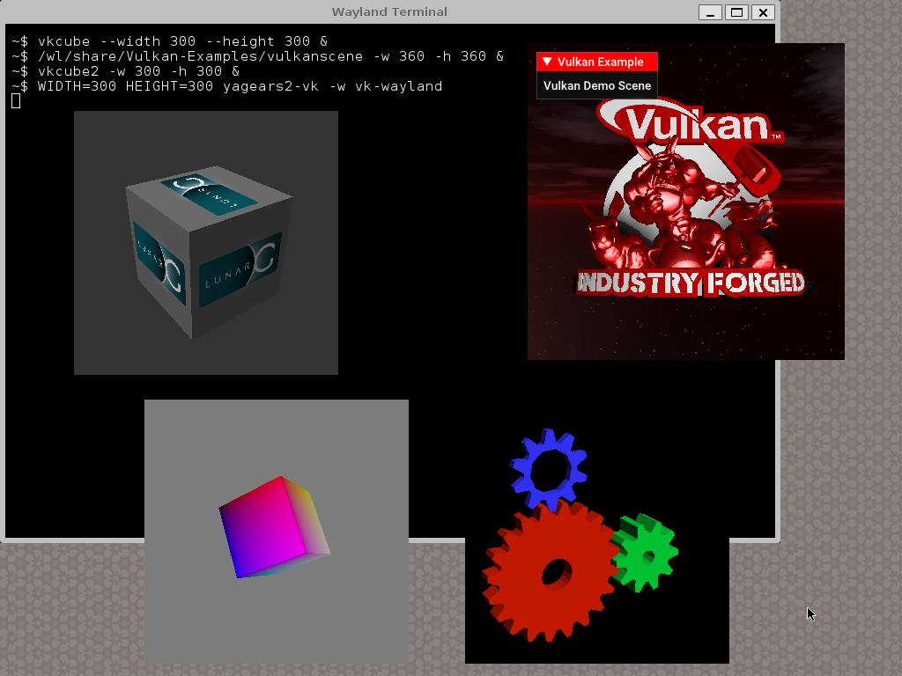
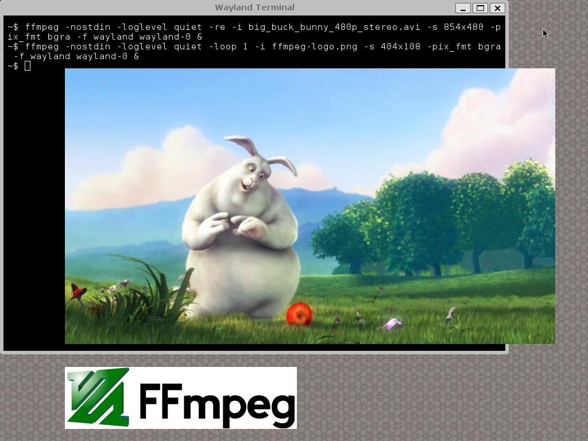
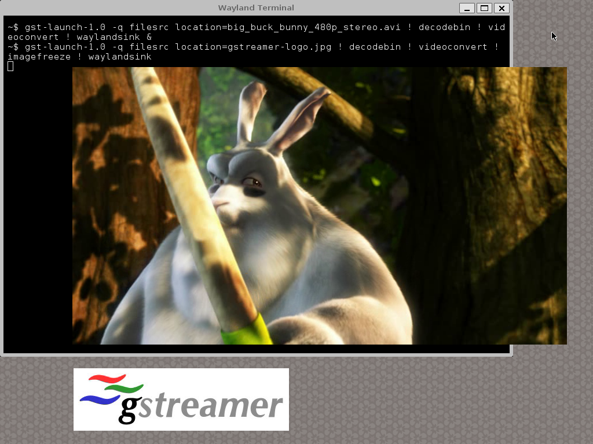
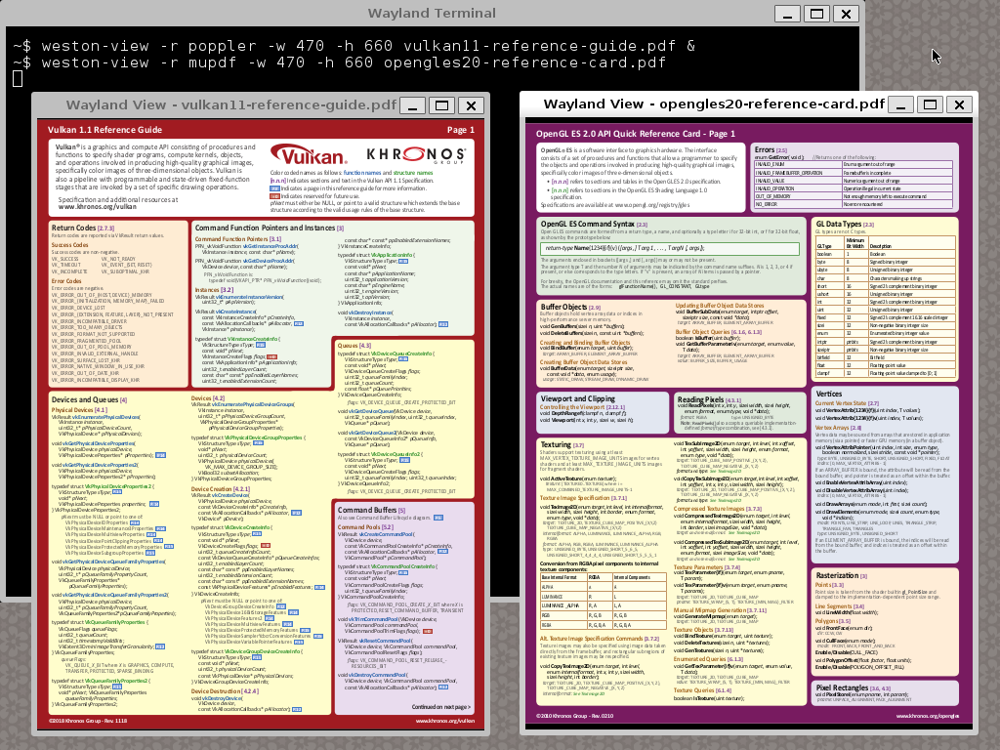
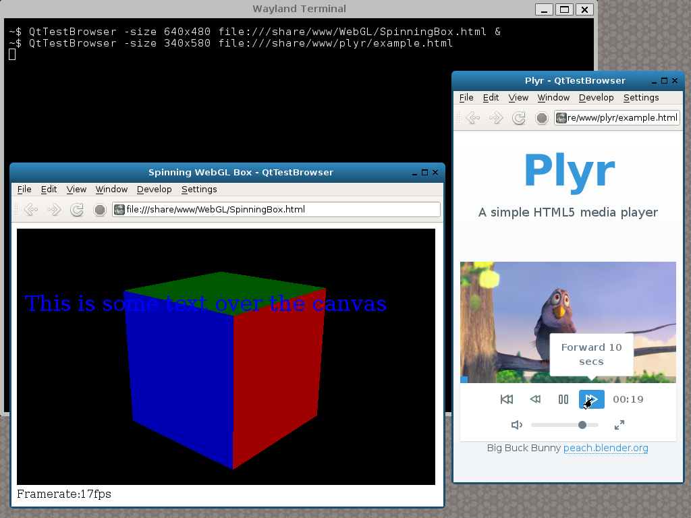
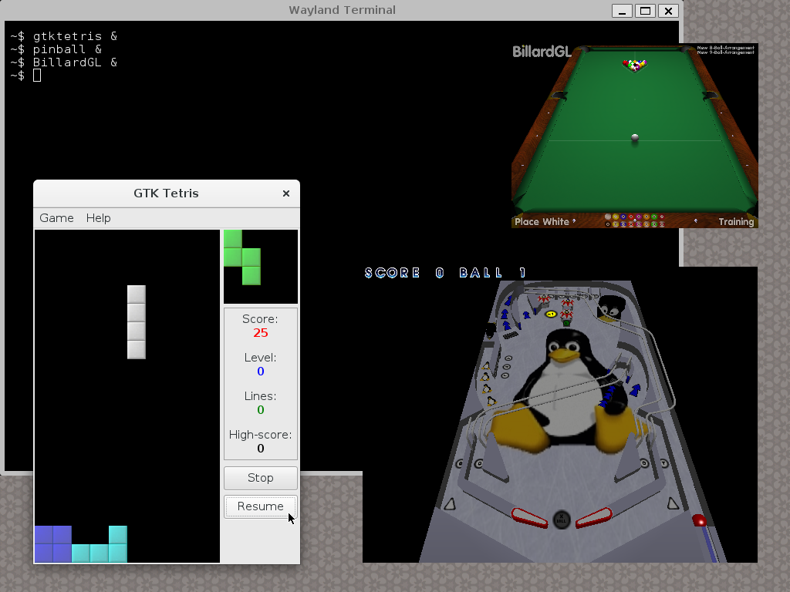

Welcome to [**HiGFXback**](README.md) with the _Wayland_ graphics backend!

# Contents

* [Getting started](#getting-started)
    * [weston-terminal](#weston-terminal)
    * [weston-clients](#weston-clients)
* [Vulkan rendering](#vulkan-rendering)
* [OpenGL rendering](#opengl-rendering)
* [Drawing libraries](#drawing-libraries)
    * [Cairo](#cairo)
    * [Evas](#evas)
* [Multimedia frameworks](#multimedia-frameworks)
    * [FFmpeg](#ffmpeg)
    * [GStreamer](#gstreamer)
* [Tools](#tools)
    * [weston-image](#weston-image)
    * [weston-view](#weston-view)
    * [NetSurf](#netsurf)
    * [mpv](#mpv)
* [Graphics abstraction layers](#graphics-abstraction-layers)
    * [GLUT](#glut)
    * [SDL](#sdl)
    * [GLFW](#glfw)
* [User interface toolkits](#user-interface-toolkits)
    * [GTK+](#gtk)
    * [Qt](#qt)
    * [EFL](#efl)
* [Applications](#applications)

# Getting started

Components running on _Wayland_ graphics backend are based on _**libwayland-client.so** library_ for the communication with _**weston**_, the _Wayland_ compositor.

If the current graphics backend used on **HiGFXback** is not _Wayland_, switch on it with `startwl` command. Select one of the following graphics driver interface available on **HiGFXback** and used by _**weston**_ for the display:

* _Linux Framebuffer_ interface (`/dev/fb0`) with _**weston fbdev-backend.so** plugin_
* _KMS/DRM_ interface with (`/dev/dri/card0`) _**weston drm-backend.so** plugin_

But depending on the platform, it's possible to use specific graphics driver interfaces based on the _**weston** backend module_ architecture.

Keyboard and mouse are managed by _**weston**_ with _**libinput.so** library_ which provides a generic input abstraction layer of the _event device_ input driver interface (`/dev/input/event0` and `/dev/input/event1`) available on **HiGFXback**.

### weston-terminal

When starting on _Wayland_ graphics backend, _**weston-terminal**_ terminal emulator is displayed.
System informations about _Wayland_ settings can be get with _**weston-info**_.

[Back to Top](#contents)

### weston-clients

Programs running on _Wayland_ graphics backend are available as examples, tests or benchmarks.

[Back to Top](#contents)

# Vulkan rendering

For display rendering with _Wayland_ graphics backend, _Vulkan_ implementation in _**libvulkan.so** library_ (loading library from _Vulkan-Loader_) and its ICD (Installable Client Driver) relies on _Wayland WSI_ interface.

On **HiGFXback**, _Wayland WSI_ interfaces (Window System Integration for _Wayland_) are used with one of the following ICD selected with `VK_ICD_FILENAMES` environment variable:

* _Mesa_ associated to _**lvp_icd.json** manifest file_
* _SwiftShader_ associated to _**swiftshader_icd.json** manifest file_

But depending on the platform, specific ICD can be used.

_**Vulkan-Tools**_, _**Vulkan-Examples**_, _**vkcube2**_ and _**yagears2**_ programs are available as examples, tests or benchmarks.

[Back to Top](#contents)

# OpenGL rendering

For display rendering with _Wayland_ graphics backend, _OpenGL_ implementation in _**libGL.so** library_, but also _OpenGL ES 1.1 CM_ implementation in _**libGLESv1_CM.so** library_ and _OpenGL ES 2.0_ implementation in _**libGLESv2.so** library_, rely on _EGL for Wayland_ interface.

Loading libraries can be used:

* _**libGLEW.so** library_ from _GLEW_ (OpenGL Extension Wrangler)
* _**libepoxy.so** library_ from _Epoxy_

On **HiGFXback**, _EGL for Wayland_ interfaces are used with one of the following implementation selected with `alternatives-GL` command:

* _Mesa_ with _**libEGL.so `->` libmesaEGL.so**, **libGL.so `->` libmesaGL.so**, **libGLESv1_CM.so `->` libmesaGLESv1_CM.so**, **libGLESv2.so `->` libmesaGLESv2.so** libraries_
* _SwiftShader_ with _**libEGL.so `->` libswiftshaderEGL.so**, **libGLESv1_CM.so `->` libswiftshaderGLESv1_CM.so**, **libGLESv2.so `->` libswiftshaderGLESv2.so** libraries_

But depending on the platform, specific implementation can be used.

_**mesa-demos**_ and _**yagears**_ programs are available as examples, tests or benchmarks.

[Back to Top](#contents)

# Drawing libraries

### Cairo

On **HiGFXback**, _Cairo_ interfaces for _Wayland_ graphics backend are provided by _**libcairo.so** library_.

_**cairo-demos**_ programs are available as examples, tests or benchmarks.

[Back to Top](#contents)

### Evas

On **HiGFXback**, _Evas_ interfaces for _Wayland_ graphics backend are provided by _**libevas.so** library_.

_**expedite**_ program is available as examples, tests or benchmarks.

[Back to Top](#contents)

# Multimedia frameworks

### FFmpeg

On **HiGFXback**, _FFmpeg_ interfaces for _Wayland_ graphics backend are provided by _**libavformat.so, libavcodec.so, libswscale.so** libraries_ and rely on _**libavdevice.so** library_ for output.

_**ffmpeg**_ program is available as example.

[Back to Top](#contents)

### GStreamer

On **HiGFXback**, _GStreamer_ interfaces for _Wayland_ graphics backend are provided by _**libgstreamer-1.0.so** library_ and rely on _**libgstwaylandsink.so** plugin_ for output.

_**gst-launch-1.0**_ program is available as example.

[Back to Top](#contents)

# Tools

### weston-image

### weston-view

### NetSurf

### mpv

[Back to Top](#contents)

# Graphics abstraction layers

### GLUT

On **HiGFXback**, _GLUT (openGL Utility Toolkit)_ interfaces running on _Wayland_ graphics backend are provided by one of the following implementation selected with `alternatives-glut` command:

* _FreeGLUT_ with _**libglut.so `->` libfreeglut.so** library_
* _TinyGLUT_ with _**libglut.so `->` libtinyglut.so** library_

_**mesa-demos**_ and _**yagears**_ programs are available as examples, tests or benchmarks.

[Back to Top](#contents)

### SDL

On **HiGFXback**, _SDL (Simple Directmedia Layer)_ interfaces running on _Wayland_ graphics backend are provided by _**libSDL2.so** library_.

_**SDL2-test**_ and _**yagears2**_ programs are available as examples, tests or benchmarks.

[Back to Top](#contents)

### GLFW

On **HiGFXback**, _GLFW (Graphics Library FrameWork)_ interfaces running on _Wayland_ graphics backend are provided by _**libglfw.so** library_.

_**GLFW-examples**_ and _**yagears2**_ programs are available as examples, tests or benchmarks.

[Back to Top](#contents)

# User interface toolkits

### GTK+

Graphical user interfaces can rely on _GTK+_ (Gimp ToolKit) using the port for _Wayland_ graphics backend.
Web rendering can then rely on _WebKitGTK+_, a port of the WebKit browser engine for _GTK+_.

On **HiGFXback**, _GTK+_ interfaces running on _Wayland_ graphics backend are provided by _**libgtk-3.0.so** library_ (which also integrates OpenGL rendering interfaces).

_**gtk-demo**_, _**gtk-tests**_, _**gtkperf**_ and _**yagears**_ programs are available as examples, tests or benchmarks.

On **HiGFXback**, _WebKitGTK+_ interfaces for _GTK+_ with _Wayland_ graphics backend are provided by _**libwebkitgtk-3.0.so** library_.

_**GtkLauncher**_ program is available as example.

[Back to Top](#contents)

### Qt

Graphical user interfaces can rely on _Qt_ (Q toolKit) using the port for _Wayland_ graphics backend.
Web rendering can then rely on _QtWebKit_, a port of the WebKit browser engine for _Qt_.

On **HiGFXback**, _Qt_ interfaces running on _Wayland_ graphics backend are provided by _**libQt5Gui.so** and **libQt5OpenGL.so** libraries_.

_**qtdemo**_, _**qt-examples**_, _**qtperf**_ and _**yagears**_ programs are available as examples, tests or benchmarks.

On **HiGFXback**, _QtWebKit_ interfaces for _Qt_ with _Wayland_ graphics backend are provided by _**libQt5WebKit.so** library_.

_**QtTestBrowser**_ program is available as example.

[Back to Top](#contents)

### EFL

Graphical user interfaces can rely on _EFL_ (Enlightenment Foundation Libraries) with _Elementary_ using the port for _Wayland_ graphics backend.

On **HiGFXback**, _EFL_ with _Elementary_ interfaces running on _Wayland_ graphics backend are provided by _**libelementary.so** library_.

_**elementary-test**_, _**elementary-examples**_ and _**yagears**_ programs are available as examples, tests or benchmarks.

[Back to Top](#contents)

# Applications

| | |
--|--
 | _**ffplay**_ multimedia player

| | |
--|--
 | _**qemu**_ machine emulator

| | |
--|--
 | _**midori**_ web browser

| | |
--|--
 | _**qupzilla**_ web browser

| | |
--|--
 | _**BillardGL, gtktetris, pinball**_ games

[Back to Top](#contents)
